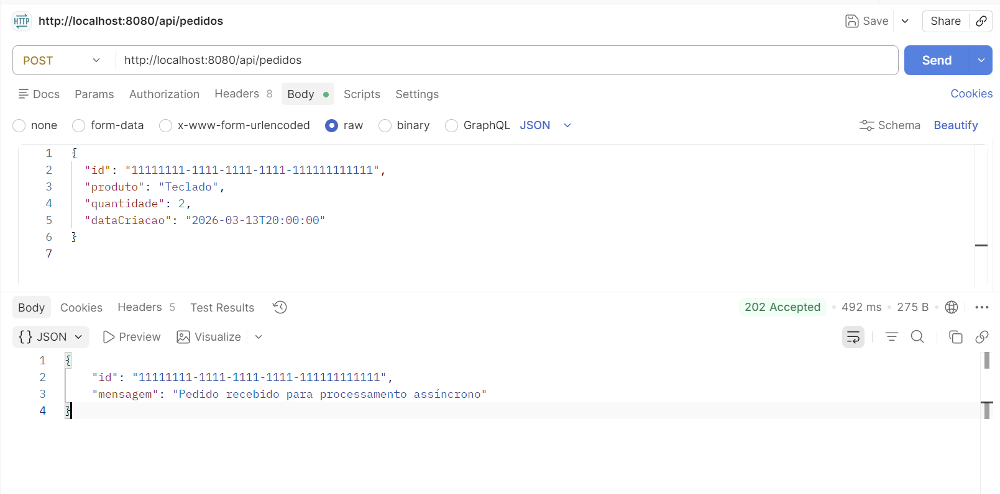
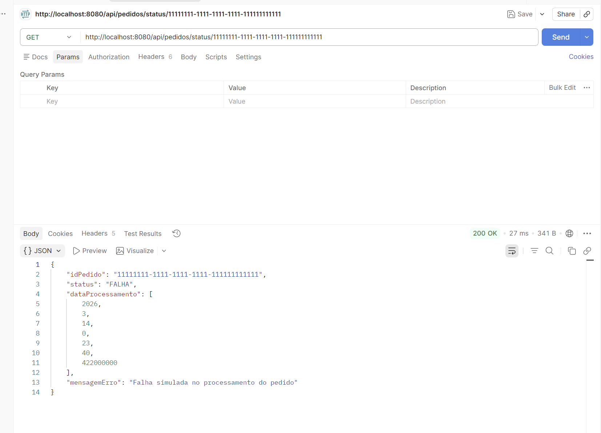

# Backend Pedidos - Teste Prático Java

Backend desenvolvido em **Java 8** com **Spring Boot 2.7.18** para recebimento e processamento assíncrono de pedidos utilizando **RabbitMQ**.

## Tecnologias utilizadas
- Java 8
- Spring Boot 2.7.18
- Spring Web
- Spring AMQP
- Maven
- RabbitMQ
- JUnit / Mockito

## Funcionalidades implementadas
- Endpoint `POST /api/pedidos` para recebimento de pedidos
- Validação de payload
- Publicação do pedido em fila RabbitMQ
- Consumo assíncrono com `@RabbitListener`
- Simulação de processamento com sucesso ou falha
- Publicação de status em filas de sucesso e falha
- Configuração de **DLQ**
- Manutenção de status em memória
- Endpoint `GET /api/pedidos/status/{id}`
- Teste unitário do publisher

## Estrutura principal
- `controller` - endpoints REST
- `service` - regras de negócio
- `consumer` - consumo assíncrono
- `config` - configuração do RabbitMQ
- `model` - modelos de domínio
- `dto` - objetos de entrada e saída
- `exception` - tratamento de exceções

## Filas utilizadas
- `pedidos.entrada.luis-trindade`
- `pedidos.entrada.luis-trindade.dlq`
- `pedidos.status.sucesso.luis-trindade`
- `pedidos.status.falha.luis-trindade`

## Como executar

### 1. Clonar o projeto
```bash
git clone https://github.com/ProgRS/backend-pedidos-teste-java.git
```

### 2. Entrar na pasta do projeto
```bash
cd backend-pedidos-teste-java
```

### 3. Executar a aplicação
```bash
mvn spring-boot:run
```

A aplicação sobe em:

```text
http://localhost:8080
```

## Endpoints

### Criar pedido
**POST** `/api/pedidos`

Exemplo de payload:

```json
{
  "id": "11111111-1111-1111-1111-111111111111",
  "produto": "Teclado",
  "quantidade": 2,
  "dataCriacao": "2026-03-13T20:00:00"
}
```

Exemplo de resposta:

```json
{
  "id": "11111111-1111-1111-1111-111111111111",
  "mensagem": "Pedido recebido para processamento assíncrono"
}
```

### Consultar status
**GET** `/api/pedidos/status/{id}`

Exemplo:

```text
GET /api/pedidos/status/11111111-1111-1111-1111-111111111111
```

Exemplo de resposta com sucesso:

```json
{
  "idPedido": "11111111-1111-1111-1111-111111111111",
  "status": "SUCESSO",
  "dataProcessamento": [
    2026,
    3,
    14,
    0,
    23,
    40,
    422000000
  ],
  "mensagemErro": null
}
```

Exemplo de resposta com falha:

```json
{
  "idPedido": "11111111-1111-1111-1111-111111111111",
  "status": "FALHA",
  "dataProcessamento": [
    2026,
    3,
    14,
    0,
    23,
    40,
    422000000
  ],
  "mensagemErro": "Falha simulada no processamento do pedido"
}
```

## Evidências de execução

### POST /api/pedidos


### GET /api/pedidos/status/{id}


## Observações
- O projeto utiliza status em memória, sem banco de dados.
- O processamento assíncrono simula sucesso e falha aleatória.
- Em caso de falha, a mensagem é rejeitada e encaminhada para a DLQ.
- A conexão com RabbitMQ foi configurada conforme o enunciado do teste.
- A aplicação foi validada localmente com envio de pedido, processamento assíncrono e consulta de status.

## Testes
Foi implementado teste unitário para o componente responsável por publicar mensagens na fila:
- `PedidoPublisherTest`
